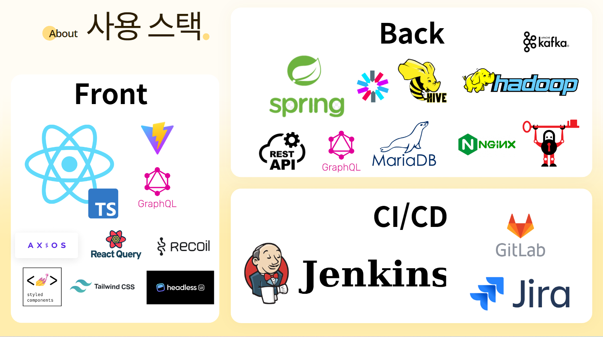
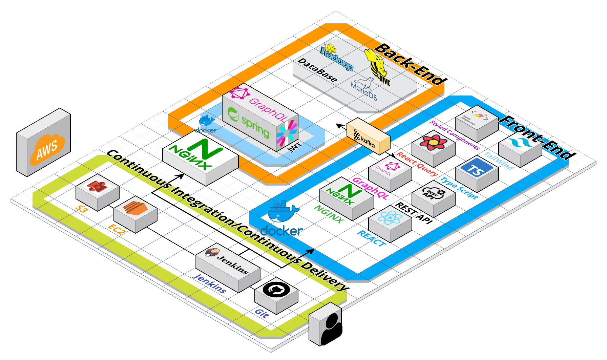
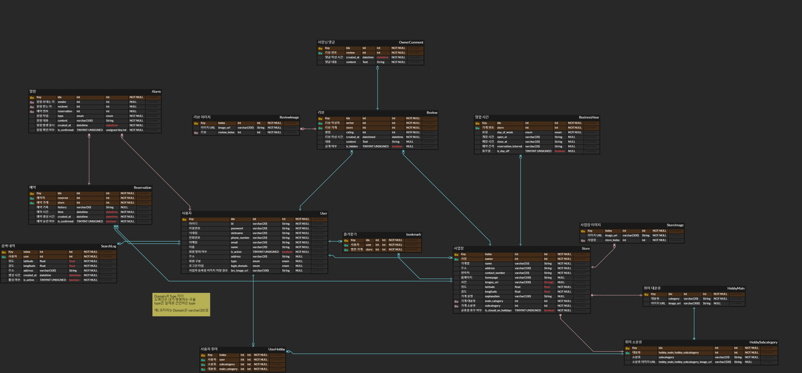
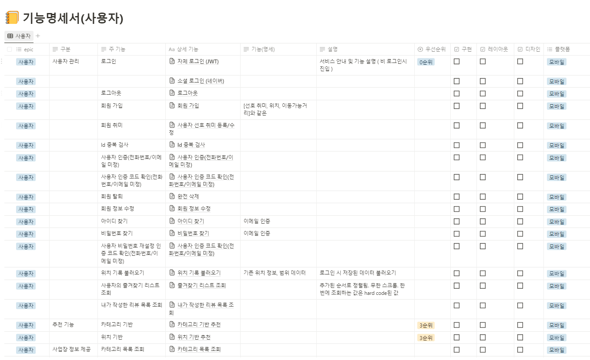
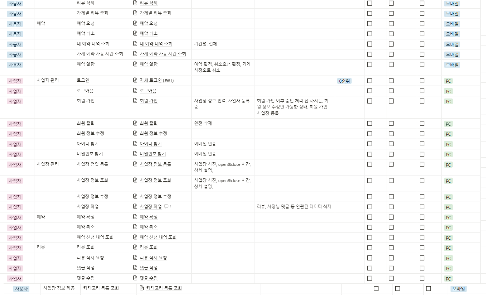
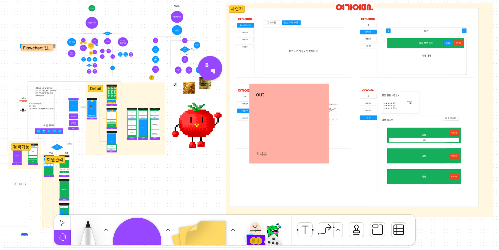
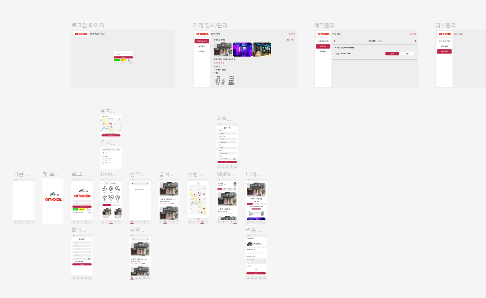

# 여가어때

<br/>

### 개발기간

2023.02.20 ~ 2023.04.07 (47일)

<br/>

# 🏄 여가어때

**여가어때** 프로젝트는 _여가시설 종합 검색 웹서비스_ 입니다. 어디서 무엇을 하고 놀지 정하지 못하고 이리저리 방황하던 경험, 검색해서 도착한 가게가 영업시간이 지났거나 휴무일이었던 경험, 영업 중이었지만 만실이었던 경험 등 여러 난감했던 상황을 해결해줄 수 있는 서비스를 고민해보다 이 프로젝트를 기획하게 되었습니다. **여가어때**는 사용자들이 주변 여가시설을 쉽게 검색하고, 영업시간과 예약이 가능한지 등의 정보를 확인할 수 있습니다.

<br/>

# 📄 Description

### 기능

- 로그인, 회원가입
  
  - JWT 방식 로그인 및 회원가입
  - 일반 사용자와 사업자 회원가입 분리

- 홈페이지
  
  - 위치 선택
    
    - 가장 마지막 저장한 주소 기본 등록
    - 최근에 검색한 주소 5개까지 출력
    - 주소 검색후 지도에서 확인
    - 지도 클릭으로도 주소 설정 가능
  
  - 대분류 선택
    
    - 대분류 선택 후 설정한 주소 주변 대분류 필터링이 된 여가시설 표시
  
  - 기본 추천 기능
    
    - 설정한 주소를 기반으로 가까운 가게를 추천
  
  - 유저 추천 기능
    
    - 유저가 설정한 필터를 기반으로 가게 추천
    - 비로그인시 로그인 페이지로 이동 버튼 표시

- 검색페이지
  
  - 여가시설 이름 검색 기능
  - 검색후 홈페이지에 설정된 주소기준 가까운 순으로 카드로 표시, 카드 클릭시 디테일 페이지로 이동
  - 카드에서 기본적으로 대표사진과 가게이름, 소분류, 별점, 거리, 주소를 표기
  - 무한 스크롤을 적용

- 즐겨찾기
  
  - 사용자가 즐겨찾기한 여가시설 표시
  
  - 최신순으로 정렬

- 주변페이지
  
  - 홈페이지에 설정된 주소 기준으로 지도에 여가시설 표시
  
  - 필터 기능
    
    - 소분류로 원하는 필터 설정 가능
    - 소분류 클릭시 상단에 내가 선택한 소분류 실시간 표시
    - 거리 설정 및 시간 설정 가능
  
  - 지도에 표시된 마크 클릭시 여가시설 디테일 페이지로 이동
  
  - 여가시설 카드 리스트를 가까운 순으로 표시
  
  - GrapeQL을 사용

- 마이페이지
  
  - 최근 예약했던 가게 목록 표시
  
  - 내가 작성한 리뷰 표시
  
  - 예약내역 확인 가능
    
    - 예약이 완료되면 알림표시

- 사업자 페이지
  
  - 내 가게 정보 표시 및 수정
  - 가게 예약 확인 및 수락, 거절
  - 가게 리뷰 확인 및 코멘트 작성

# 💻 Design

### 기술스택



### 시스템 구조



### ERD 다이어그램



### 기능명세서





### 와이어프레임



### 피그마

[Figma](https://www.figma.com/file/ayUe2QnQwDTYR6QJzeS2o4/D110-%ED%8A%B9%ED%99%94-NP?t=6RB53WVDtJvXjXH9-0)



### 사용 라이브러리

##### BackEnd

| 이름         | 사용 이유                   |
|:----------:|:----------------------- |
| Hadoop     | 빅데이터 분산 처리              |
| Hive       | Hadoop 데이터 쿼리 처리        |
| Docker     | 컨테이너화 배포 && 서버 분산       |
| graphql    | 복잡한 서버 request를 간단하게 처리 |
| Springboot | CRUD API 설계 및 REST 배포   |
| Jwt        | 로그인 기능 구현               |
| Jenkins    | CICD 배포 자동화             |
| MariaDB    | Relational DataBase     |
| Workbench  | RDBMS                   |

##### FrontEnd

| 이름                     | 사용 이유                                |
| ---------------------- |:------------------------------------ |
| Recoil                 | 전역 상태 관리                             |
| react-query            | 서버 fetch data 전역 관리 및 fetch 관련 상태 관리 |
| Tailwind               |                                      |
| Styled-components      | CSS in js를 통해 JS에서 CSS를 조작 하기 위해     |
| axios                  | 서버 통신                                |
| graphql                | 복잡한 서버 request를 간단하게 처리              |
| react-cookie           | 사용자 accessToken 관리                   |
| naver map api          | 네이버 지도 표시                            |
| react-hook-geolocation | 네이버 지도 api에서 위,경도 변환                 |

### Directory 구조

##### BackEnd

```
📁Back/specialized
├──📁gradle
├──📁src
│ ├──📁test
│ ├──📁main
│ │ ├──📁java
│ │ │ ├──📁com/ssafy/specialized
│ │ │ │ ├──📁controller
│ │ │ │ ├──📁repository
│ │ │ │ ├──📁service
│ │ │ │ ├──📁common
│ │ │ │ │ ├──📁config
│ │ │ │ │ ├──📁enums
│ │ │ │ │ ├──📁exception
│ │ │ │ │ ├──📁jwt
│ │ │ │ │ ├──📁security
│ │ │ │ ├──📁domain
│ │ │ │ │ ├──📁dto
│ │ │ │ │ ├──📁entity
│ │ │ │ │ ├──📁graphql
│ │ │ │ │ ├──📁mapping
│ │ │ │ ├──📄SpecializedApplication.java
│ │ ├──📁resources
│ │ │ ├──📁graphql
│ │ │ ├──📄application.yml
│ │ │ ├──📄application-key.yml
├──📄build.gradle
├──📄Dockerfile
├──📄gradlew
├──📄gradlew.bat
├──📄setting.gradle
```

##### FrontEnd

```
📁Front
├──📁public
├──📁src
│ ├──📁assets
│ ├──📁components
│ │ ├──📁AuthForm
│ │ ├──📁HomePage
│ │ ├──📁MyPage
│ │ ├──📁Navbar
│ │ ├──📁OwnerForm
│ │ ├──📁OwnerPage
│ │ ├──📁OwnerReview
│ │ ├──📁Places
│ │ ├──📁SearchPage
│ │ ├──📁Topbar
│ ├──📁pages
│ │ ├──📁home
│ │ ├──📁owner
│ │ ├──📁places
│ │ ├──📁search
│ │ ├──📁user
│ ├──📁svg
│ ├──📁utils
│ │ ├──📁api
│ │ ├──📁hooks
│ │ ├──📁recoil
│ │ ├──📄PrivateRouter.tsx
│ ├──📄App.tsx
│ ├──📄Desktop.tsx
│ ├──📄index.css
│ ├──📄main.tsx
│ ├──📄Mobile.tsx
├──📄Dockerfile
├──📄package.json
├──📄package-lock.json
├──📄postcss.config.cjs
├──📄tail.wind.config.cjs
├──📄tsconfig.json
├──📄tsconfig.node.js
├──📄vite.config.ts
```

# 구사 일생 팀

---

---

## Conventions Rule

### Commit Type

- feat : 새로운 기능 추가, 기존의 기능을 요구 사항에 맞추어 수정
- fix : 기능에 대한 버그 수정
- build : 빌드 관련 수정
- chore : 패키지 매니저 수정, 그 외 기타 수정 ex) .gitignore
- ci : CI 관련 설정 수정
- docs : 문서(주석) 수정
- style : 코드 스타일, 포맷팅에 대한 수정
- refactor : 기능의 변화가 아닌 코드 리팩터링 ex) 변수 이름 변경
- test : 테스트 코드 추가/수정
- release : 버전 릴리즈

## REST API

### URI

#### 1. 마지막에 `/` 를포함하지 않는다.

**Bad**

```
http://api.test.com/users/
```

**Good**

```
http://api.test.com/users
```

#### 2. _(underbar) 대신 -(dash)를 사용한다.

-(dash)의 사용도 최소한으로 설계한다. 정확한 의미나 표현을 위해 단어의 결합이 불가피한 경우 반드시 -(dash) 사용한다.

**Bad**

```
http://api.test.com/users/post_commnets
```

**Good**

```
http://api.test.com/users/post-commnets
```

#### 3. 소문자를 사용한다.

**Bad**

```
http://api.test.com/users/postCommnets
```

**Good**

```
http://api.test.com/users/post-commnets
```

#### 4. 행위(method)는 URI 에 포함하지 않는다.

**Bad**

```
POST http://api.test.com/users/1/delete-post/1
```

**Good**

```
DELETE http://api.test.com/users/1/posts/1
```

#### 5. 컨트롤 자원을 의미하는 URI 는 예외적으로 동사를 허용한다.

함수처럼, 컨트롤 리소스를 나타내는 URL은 동작을 포함하는 이름을 짓는다.

**Bad**

```
http://api.test.com/posts/duplicating
```

**Good**

```
http://api.test.com/posts/duplicate
```

### Use HTTP status

#### 1. 의미에 맞는 HTTP status 를 리턴한다.

**Bad**

```http
HTTP/1.1 200 OK

{
    "result" : false
    "status" : 400
}
```

- status는 `200`으로 성공인데 body 내용엔 실패에 관한 내용을 리턴하고 있다.
  - 모든 응답을 `200`으로 처리하고 body 내용으로 `성공|실패`를 판단하는 구조에서 사용된다. 잘못된 설계다.

**Good**

```http
HTTP/1.1 400 Bad Request

{
    "msg" : "check your parameter"
}
```

#### 2. HTTP status 만으로 상태 에러를 나타낸다.

세부 에러 사항은 응답 객체에 표시하거나, 해당 에러를 확인할 수 있는 link를 표시한다.

**http 상태 코드를 응답 객체에 중복으로 표시할 필요 없다.**

**Bad**

```http
HTTP/1.1 404 Not Found

{
    "code" : 404,
    "error_code": -765
}
```

**Good**

```http
HTTP/1.1 404 Not Found

{
    "code" : -765,
    "more_info" : "https://api.test.com/errors/-765"
}
```

### HTTP status code

#### 2XX Success

- 200 OK
- 201 Created
- 202  Accepted
- 204 No Content

#### 4XX Client errors

- 400 Bad Request
- 401 Unauthorized
- 403 Forbidden
- 404 Not Found
- 405 Method Not Allowd
- 409 Conflict
- 429 Too many Requests

#### 5XX Server errors

### `5XX` 에러는 사용자에게 나타내지 않는다.
